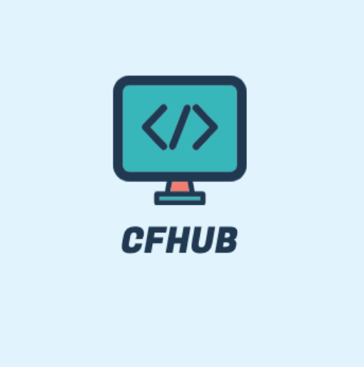

<h1 align="center">
  
   
  CodeForcesHub - Automatically sync your code to GitHub.
   
   
</h1>

An Extension for Automatic Uploading CF solutions in github!

## How to use as a developer mode?

As I didn't published using chrome web store, you can use it as like as the following way.:

<ol>
  <li>Clone the full repository</li>
  <li>Go to the chrome extension manager : chrome://extensions/</li>
  <li>Turn on the developer mode. (you will find the option on the right top corner)</li>
  <li>Now load the full code repository by clikcing on the 'load unpacked option' from the left top corner</li>
</ol>

## How does CodeForcesHub work?     

It's as simple as:

<ol>
  <li>After installation, launch CodeForcesHub.</li>
  <li>Click on "authorize with GitHub" button to automatically set up your account with CodeForcesHub.</li>
  <li>Setup an existing/new repository with CodeForcesHub (private by default) by clicking "Get Started" button.</li>
  <li>Begin coding! To view your progress, simply click on the extension!</li>
</ol>

#### BONUS: Star [this repository](https://github.com/mahbubcseju/CodeForcesHub) for further development of features. If you want a particular feature, simply [request](https://github.com/mahbubcseju/CodeForcesHub/labels/feature) for it!

#### This work is inspired by [this repository](https://github.com/QasimWani/LeetHub) and most of the code is collected from this repo!! 